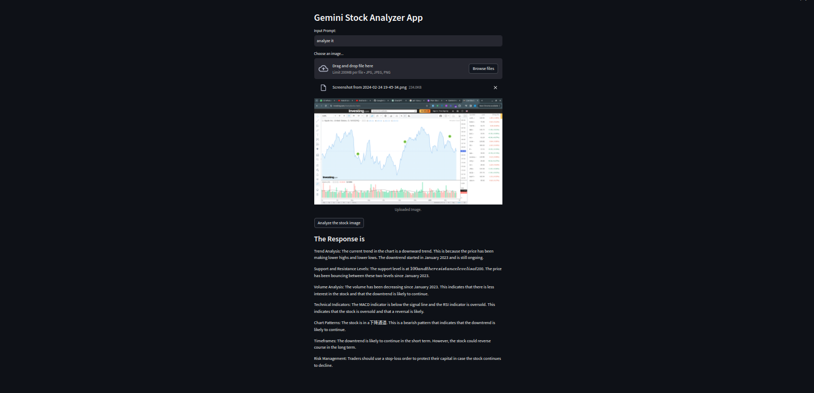
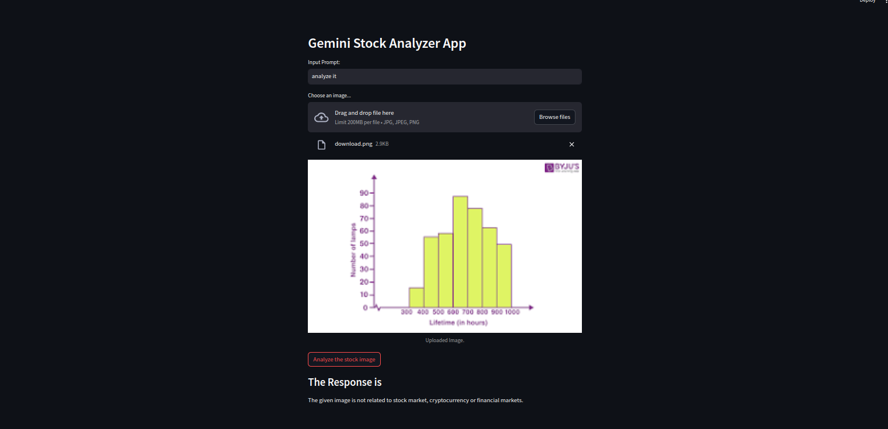

# Financial Chart Detective App

Financial Chart Detective App is a tool built with Streamlit and Google Generative AI that analyzes stock market, cryptocurrency, and financial market charts using AI models.

## Features

- Analyze stock market, cryptocurrency, and financial market chart images.
- Predict future trends and patterns in the markets.
- Identify trend analysis, support and resistance levels, volume analysis, technical indicators, chart patterns, timeframes, and risk management strategies.
- Provide additional insights derived from visual analysis.

## How to Use

1. **Input Prompt**: Enter a prompt describing the analysis you want to perform.
2. **Choose an Image**: Upload an image of a stock market, cryptocurrency, or financial market chart.
3. Click on **Analyze the image** button to initiate the analysis.

## Getting Started

1. Install the required dependencies:

```bash
pip install -r requirments.txt
```

2. Set up your Google API key by creating a `.env` file in the root directory of your project and adding your API key:

```
GOOGLE_API_KEY=your_google_api_key
```

3. Run the Streamlit app:

```bash
streamlit run your_app.py
```

## Dependencies

- Streamlit: for building the web application interface.
- Google Generative AI: for generating responses based on the input prompt and image.
- Pillow: for handling image files.
- python-dotenv: for loading environment variables from the `.env` file.

## Sample Images and Responses

### Relevant Image



### Irrelevant Image



## Note

- Make sure your input images are relevant to the stock market, cryptocurrency, or financial markets for accurate analysis.
